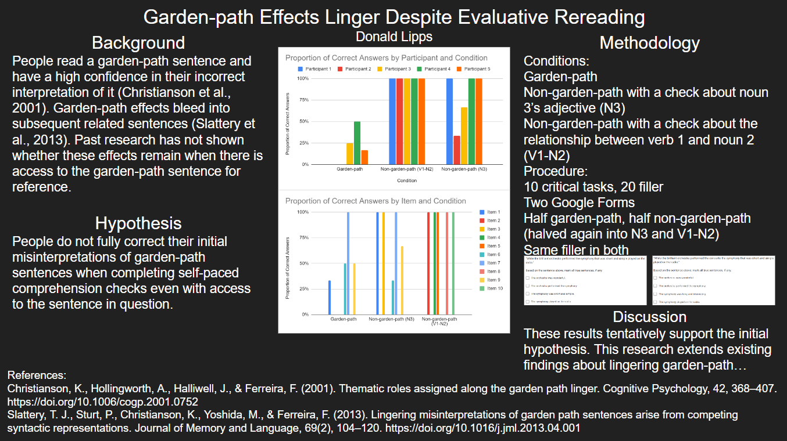

First Reading Misconceptions Persist, aka Garden-path Effects Linger Despite Evaluative Rereading, was a psycholinguistics (the crossover between psychology and linguistics) project I did as part of my LING 412 class.

For background information and exigency, I read through parts of 10 research papers and used them to write a ~8 page research paper (excluding boilerplate essay components and appendices) in the form of a proposal prior to the experiment's implementation. After recieving feedback on the project's methodology, I gathered participants and ran the experiment. I used some basic spreadsheet manipulation to process the data and create graphs of my results. 

The subject my project was about is quite particular and decently complex, but to summarize, the 'garden-path' effect is when a sentence is initially interpreted by your brain with one meaning, only to be reinterpreted with a completely different understanding toward the end of the sentence. A commonly used example sentence inducing this effect is: 

>"While the man hunted the deer ran into the woods." 

Which could be more clearly written as:

>"While the man hunted, the deer ran into the woods."

My research focused specifically on whether or not this effect would be corrected if people were allowed to reread the sentence while answering questions about them - and the results tentatively showed that people do not tend to correct their initial misunderstandings.

Here is the poster-style breakdown of the project:

  

