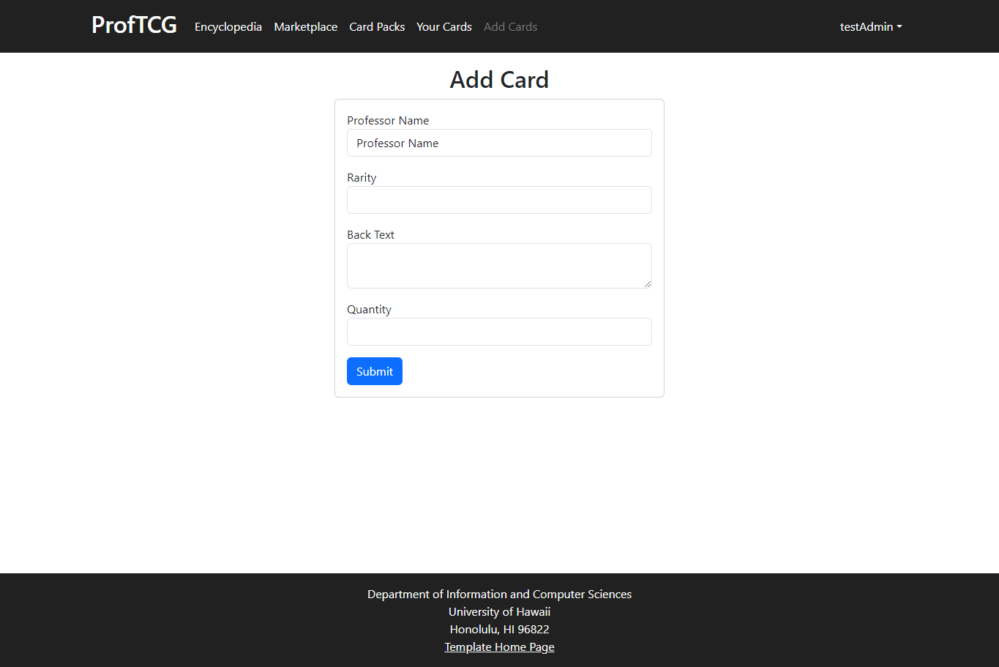
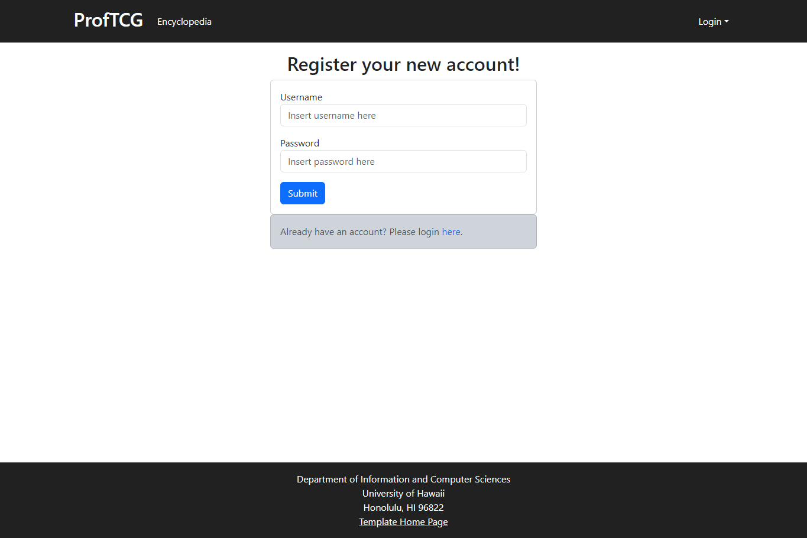

### Overview
ProfTCG is a professor trading card web application which allows users to collect and trade cards based on UH Manoa's ICS professors.
This project is intended to help with the problem of disconnect between students and professors. Specifically, the difficulty of networking and socializing with professors: learning their areas of research interest, getting to know them as a person, and more.

By providing students with an engaging opportunity to read fun facts about their professors - including past/current research and bits of trivia - as well as by starting conversations about these topics among students through the trading feature, we worked to alleviate this issue in a fun and interesting way.

As this was a team project, I did not work on every section. My primary areas of interest were the process of adding new cards to our collection, account management, and our User Guide. I also participated in team discussions about back-end organization and other functionality.

### Add Cards

  

This was the area I did the most 'true' software development, in the sense that I added the most functionality to our product here. My task was to create a page where an admin user could add any number of copies of a card with the name and a headshot of a particular professor, a rarity, and a text description. 

I had to read over and work with the schema for a professor card object that another team member wrote to make sure the back-end would work correctly. I found a way to make the process of adding new cards easy and intuitive, using radio buttons initially (although they were replaced by a team member with a dropdown that was better when scaled) and number/text input areas which were validated for acceptable inputs. For example, a card's rarity could be from 1-4, so the rarity entry only accepted those values. In my first passover, the input areas effectively required an admin to type in the exact link to professor headshots in our program files. This slapdash solution was set up to allow other team members to move forward with implementing and testing other functionality that depended on it, like the trading feature. Upon a revisit, I found that, since valid cards could only be an ICS professor with an image in our files, I could simply have an admin choose a valid professor and then provide the image details to the schema from there. 

### Account Management

  

I edited our account system to use usernames rather than e-mail to make the user experience feel less clinical, and make UI/UX changes to the sign up-in-out pages for increased legibility and appearance - these changes include panel coloring and the removal of link underlines. Under the suggestion of a team member, the sign-out page has a .gif of a friendly character.

### User Guide
I wrote up the entire User Guide and did all the screenshots. Documentation and guide-writing are somewhat underappreciated, but helped me get an understanding of the narrative of a user as they move through our application. Doing so taught me just how important that narrative is, which I intend to implement in future projects (specifically their design periods). 

The entire user guide I wrote can be found [here](https://proftcg.github.io/#user-guide).

### Takeaways
This was the first true software development project I have ever worked on. I learned a lot about project management, coding standards, functional programming, and their applications to software development as well as other parts of my life, which I discuss [here](looking-back-and-moving-forward.md).

More practically, I learned about using GitHub to do version control within a team, becoming quite familiar with most of its day-to-day uses. I also got experience designing and building a web application, starting with brainstorming the idea behind a project and working as part of a team all the way to a finished product. Finally, I learned how to deliberately design and build an application function with user error, interests, and narrative in mind.

A link to our GitHub repo can be found [here](https://github.com/proftcg).
